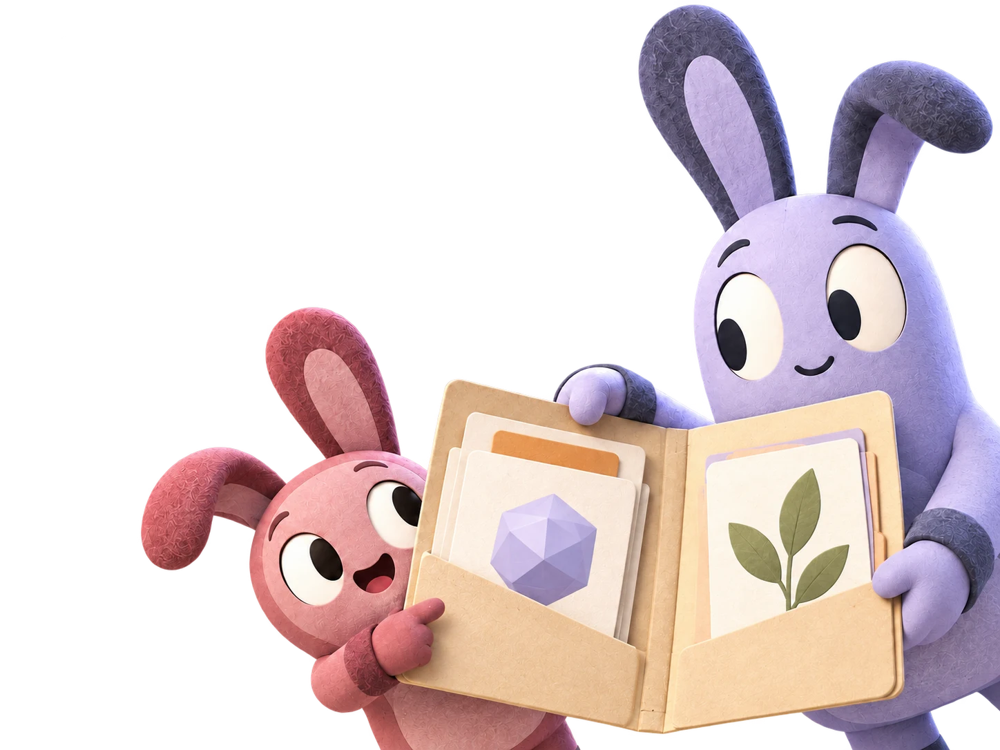

<div align="center">
  

  # Luddies

  **A STEM educational marketplace for Mexico and Latin America.**
</div>

Luddies brings bilingual teaching resources together in a warm, accessible,
and responsive experience. This repository contains the multi-page web client,
a Spring Boot REST API, MySQL persistence, and an automated quality suite.

## Features

- Public catalog with search, filters, pagination, and product detail pages.
- Persistent selection, demo checkout, and simulated payment confirmation.
- Registration, sign-in, and session-based administrative authorization.
- Product management and user directory for administrators.
- Complete Spanish and English experiences.
- Responsive layouts, keyboard navigation, and reduced-motion support.

> [!IMPORTANT]
> The payment flow is a demonstration. It does not charge users, store card
> details, or create paid orders. Material delivery and a real payment provider
> are not enabled yet.

## Architecture

```text
client/                         HTML, CSS, and JavaScript web application
src/main/java/                  Spring Boot application and REST API
src/test/java/                  server integration tests
server/src_db/main/resources/   MySQL schema and seed data
tests/                          client behavior tests
```

Spring Boot exposes the API under `/api/**` and packages `client/` as static
resources. The browser communicates with the API through the current origin,
so no server address is hard-coded into the client.

## Quick start

### Frontend demo

Requires Node.js 20 or later.

```shell
npm ci --ignore-scripts
npm run serve
```

Open <http://localhost:4173/>. In static mode, accounts, catalog changes, and
the current selection exist only in that browser. See
[client/README.md](client/README.md) for the fictional demo credentials and the
explicit choice between demo and API modes.

### Full application

Requires Java 21 and MySQL 8 or later.

1. Run `server/src_db/main/resources/db/create.sql` and `insert.sql`.
2. Set `DB_URL`, `DB_USERNAME`, and `DB_PASSWORD`. Every supported variable is
   documented in [.env.example](.env.example).
3. Start the application:

```shell
./gradlew bootRun
```

Open <http://localhost:8080/>. Seeded accounts are disabled and have no usable
password. Register an account and grant its administrative role through a
trusted database operator.

## Verification

```shell
npm ci --ignore-scripts
npm run check
npm test
./gradlew clean test bootJar
```

Java tests use H2 and do not require local MySQL credentials. Continuous
integration runs the same client checks and server build for every change to
`main`.

## Release artifact

Each backend release may include an executable Spring Boot JAR. The
`luddies-VERSION.jar` asset contains the API, runtime dependencies, and the web
client in one deployable file. It is not a desktop installer.

After configuring the database environment variables, run it with:

```shell
java -jar luddies-VERSION.jar
```

The source archives attached automatically by GitHub remain available for
developers who prefer to build the project themselves.

## Deployment

- **Static demo:** publish `client/`. This does not provide an API or shared data.
- **Full application:** run the JAR on Java 21 behind HTTPS, serve the client and
  API from the same origin, and set `SESSION_COOKIE_SECURE=true`.
- Use a restricted MySQL account and keep credentials exclusively in server
  environment variables.
- Before exposing a database imported from an older version, disable or rotate
  any previously seeded demo accounts.

Account recovery, email verification, distributed rate limiting, and a
provider-verified webhook checkout remain requirements before processing real
transactions.

## Changelog

See [CHANGELOG.md](CHANGELOG.md) for release history.

## Origin and authorship

This repository is a technical and visual evolution of the team project
[EdwinSanchezA720/luddiesHoldings](https://github.com/EdwinSanchezA720/luddiesHoldings).
The original repository remains the source of the product concept and initial
implementation. This version contains the subsequent refactor and credits its
participants within the experience itself.

## License

Copyright © 2026 Luddies Holdings. All rights reserved. This is proprietary
software and no permission to use, copy, modify, or distribute it is granted.
See [LICENSE](LICENSE) for the complete terms. Third-party dependencies and
materials remain subject to the licenses and rights of their respective owners.
